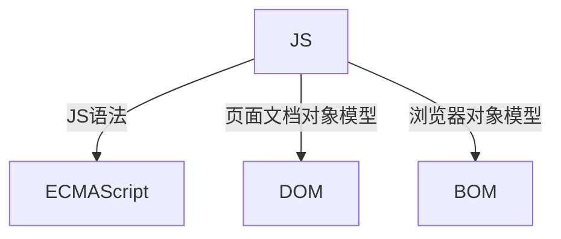
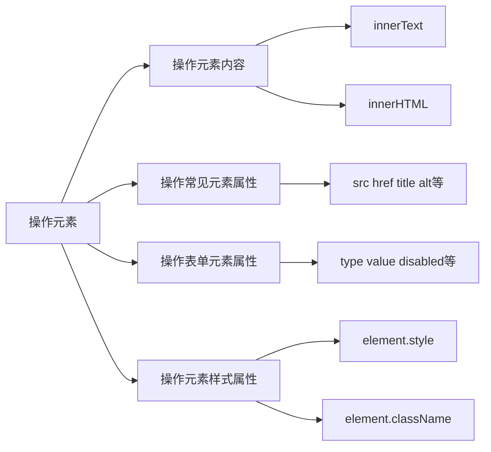
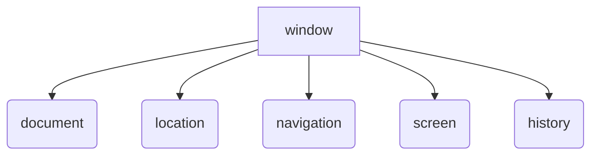

# API

应用程序编程接口，就是一个工具，以便于能轻松实现想要完成的功能

# Web API

Web API是浏览器提供的一套操作浏览器功能和页面元素的API（DOM和BOM）

# DOM

可以改变网页的内容、结构和样式

## DOM树


文档：一个页面就是一个文档  document
元素：页面中的所有标签都是元素，element
节点：网页中的所有内容都是节点（标签、属性、文本、注释等），node

**DOM把以上内容都看作是对象**

# DOM操作

## 获取元素

### getElementById()

注意：
- 因为文档页面从上往下加载，所以先有标签，然后才能getElementById
- 参数是字符串，所以需要加引号
- 返回的是一个 element 对象

console.dir 可以打印返回的元素对象，更好的查看里面的属性和方法

### getElementsByTagName()

- 参数是字符串，所以需要加引号d
- 得到的是对象的集合，可以用遍历来获取所有对象
- 得到的是动态的
例子: 获取ol里面的li

```html
<ol>
<li>123一二三四五</li>
<li>123上山打老虎</li>
<li>123老虎有几只</li>
<li>123快来数一数</li>
<li>123一二三四五</li>
</ol>
<script>
var ol = document.getElementsByTagName('ol');
//伪数组不能做父元素
var list = ol[0].getElementsByTagName('li');
console.log(list);
console.dir(list);
```

### getElementsByClassName()

类名选择器

### querySelector()

HTML5新增的

返回指定选择器的**第一个对象**

```html
<div class="box">
<ul>
<li>15212</li>
<li>1641238</li>
</ul>
</div>
<div class="box">
<ul>
<li>151232</li>
<li>1612348</li>
</ul>
</div>
<script>
//注意这里括号里面必须有“.”，因为需要指定选择的选择器
var boxs = document.querySelector('.box');
console.log(boxs);
</script>
```

### querySelectorAll()

返回指定选择器的所有对象集合
用法和querySelector()一样

### document.body

获取body元素

### document.documentElement

获取html元素

## 事件基础

JavaScript使我们有能力创建动态页面，而事件是可以被JavaScript侦测到的行为。
网页中的每个元素都可以产生某些触发JavaScript的事件。

### 事件由三部分组成：

- 事件源   事件被触发的对象 比如按钮
- 事件类型   如何触发 比如鼠标点击、鼠标经过、键盘按下、滚动滚轮
- 事件处理程序   通过函数赋值的方式完成


```html
<button id="btn">按钮</button>
<script>
    var btn = document.getElementById('btn');
    btn.onclick = function () {
        alert('触发事件');
    }
</script>
```


事件都有：


| 鼠标事件 | 触发条件 |
| ------ | ------ |
| onclick | 鼠标点击左键触发 |
| onmouseover | 鼠标经过触发 |
| onmouseout | 鼠标离开触发 |
| onfocus | 获得鼠标焦点触发 |
| onblur | 失去鼠标焦点触发 |
| onmousemove | 鼠标移动触发 |
| onmouseup | 鼠标弹起触发 |
| onmousedown | 鼠标按下触发 |

## 操作元素

JavaScript可以改变网页内容、结构和样式，我们可以利用DOM操作元素来改变元素里面的内容、属性等。

### element.innerText

- 从起始位置到终止位置的内容，但它去除Html标签，同时空格和换行也会去掉
- innerText不识别HTML标签
- 可读写的，可以获取元素里面的内容

### element.innerHTML

- 从起始位置到终止位置的全部内容，包括Html标签，同时保留空格和换行
- 能识别HTML标签
- 可读写的，可以获取元素里面的内容

### 修改表单属性

disabled 	让某个表单被禁用，不能被点击，
用法：
```javascript
btn.onclick = function () {
    btn.disabled = true;
    //或者写成下面这种
    this.disabled = true;
    //this指向的是时间函数的调用者
}
```

**案例**：仿京东显示密码，点击按钮将密码框显示为文本框，并可以查看密码明文

算法：利用一个flag变量，如果是1就切换为文本框，如果是0就切换为密码框

```html
<!DOCTYPE html>
<html lang="en">
<head>
    <meta charset="UTF-8">
    <title>Document</title>
    <style>
    * {
        margin: 0;
        padding: 0;
    }
    form {
        position: relative;
        width: 1000px;
        height: 500px;
        border: 1px solid red;
        margin: 100px auto 0;
    }
    input {
        display: block;
        width: 800px;
        height: 50px;
        line-height: 30px;
        color: #3c3c3c;
        margin: 50px auto 50px;
        padding-left: 20px;
        box-sizing: border-box;
        border: 1px solid red;
    }
    label img {
        top: 164px;
        right: 120px;
        position: absolute;
        width: 24px;
    }
    </style>
</head>
<body>
    <form action="#">
        <input type="text" id="userName" placeholder="请输入你的用户名">
        <label for="">
            
        </label>
        <input type="password" id="password" placeholder="请输入你的密码">
    </form>
    <script>
    var eye = document.querySelector('img');
    var password = document.getElementById('password');
    var flag = 0;
    eye.onclick = function () {
        if (flag === 0) {
            password.type = 'text';
            eye.src = 'images/睁眼.png';
            flag = 1;
        } else {
            password.type = 'password';
            eye.src = 'images/闭眼.png';
            flag = 0;
        }
 
    }
    </script>
</body>
</html>
```

### 修改样式属性

#### element.style

行内样式操作，修改元素样式，如果样式比较少或者功能简单的情况下使用
注意：
- 里面的属性是驼峰命名法
- JS修改的是行内样式，权重比CSS的高
- 
#### element.className

类名样式操作，适合样式比较多的情况下使用
修改了元素的类名

**注意：**这个方法直接修改了类名，也就是说会覆盖原来的类名，原来的就不生效了
如果想要保留原先的类名，这样做：

```
//假设first 是原来的类名，change是想加入的
this.className = 'first change';
```

#### 表单事件

获得焦点 onfocus
失去焦点 onblur

案例：京东搜索框，默认是“手机”两个字，当用户点击搜索框的时候，“手机”两个字消失，当输入文本之后，保持文本内容不变

分析：
- 如果获得焦点，判断里面是否是默认文字，如果是默认文字，就清空表单内容
- 如果失去焦点，判断表单是否为空，如果为空，则表单内容改为默认文字
- 获得焦点的时候，把文本框里的文字变黑
- 失去焦点的时候，文本框文字变浅

```html
<input type="text" value="手机">
<script>
var input = document.querySelector('input');
input.onfocus = function () {
    if (this.value === '手机') {
    	input.value = '';
    }
    this.style.color = '#3c3c3c'; 
}
input.onblur = function () {
    if (this.value === '') {
    	input.value = '手机';
    }
    this.style.color = '#999';
}
</script>
```

案例：密码提示框，选中的时候提示密码的长度和标准，失去焦点的时候，检查密码是否合乎规范

分析：
- 如果获得焦点，提示密码的长度和标准
- 如果失去焦点，检查密码是否合乎规范，如果不符合规范，就提示
- 因为改变的样式比较多，所以用className来修改样式

```html
<!DOCTYPE html>
<html lang="en">
<head>
    <meta charset="UTF-8">
    <title>Document</title>
    <style>
    div {
        width: 600px;
        margin: 100px auto;
    }
    .message {
        display: inline-block;
        font-size: 12px;
        color: #999;
        background: url(images/message.png) no-repeat left center;
        background-size: 16px;
        padding-left: 20px;
    }
    .error {
        display: inline-block;
        font-size: 12px;
        color: red;
        background: url(images/error.png) no-repeat left center;
        background-size: 16px;
        padding-left: 20px;
    }
    .right {
        display: inline-block;
        font-size: 12px;
        color: green;
        background: url(images/right.png) no-repeat left center;
        background-size: 16px;
        padding-left: 20px;
    }
    </style>
</head>
<body>
    <div class="register">
        <input type="password" class="pwd">
        <p class="message">请输入6~16位密码</p>
    </div>
    <script>
    var pwd = document.querySelector('.pwd');
    var message = document.querySelector('.message');
    pwd.onblur = function() {
        if (pwd.value.length > 16 || pwd.value.length < 6) {
            
            message.className = 'error';
            message.innerHTML = '您输入的位数不对，要求6~16位';
        } else {
            message.className = 'right';
            message.innerHTML = '对辽~';
        }
    }
    </script>
</body>
</html>
```

### 操作元素小总结



### 排他思想

两层循环，先排除其他人，然后再设置自己的样式

```html
    <button>按钮1</button>
    <button>按钮2</button>
    <button>按钮3</button>
    <button>按钮4</button>
    <button>按钮5</button>
    <script>
    var btns = document.querySelectorAll('button');
    for (var i = 0; i < btns.length; i++) {
        btns[i].onclick = function () {
            //  1. 先把所有颜色的背景颜色都清空
            for (var j = 0; j < btns.length; j++) {
                btns[j].style.backgroundColor = '';
            }
            //  2. 再把想要的背景颜色改成pink
            this.style.backgroundColor = 'pink';
        }
    }
    </script>
```

案例：百度换肤效果

分析：
- 利用循环给一组元素注册点击事件
- 当鼠标经过一张图片，当前的页面背景换成经过的图片，鼠标移开之后，换回默认的
- 当点击了图片，当前的页面背景换成点击的图片
- 核心算法：把当前图片的src路径取过来，给body作为背景

```html
<!DOCTYPE html>
<html lang="en">

<head>
    <meta charset="UTF-8">
    <meta name="viewport" content="width=device-width, initial-scale=1.0">
    <meta http-equiv="X-UA-Compatible" content="ie=edge">
    <title>Document</title>
    <style>
        * {
            margin: 0;
            padding: 0;
        }

        body {
            background: url(images/bg1.jpg) no-repeat center top;
        }

        li {
            list-style: none;
        }

        .baidu {
            overflow: hidden;
            margin: 100px auto;
            background-color: #fff;
            width: 410px;
            padding-top: 3px;
        }

        .baidu li {
            float: left;
            margin: 0 1px;
            cursor: pointer;
        }

        .baidu img {
            width: 100px;
        }
    </style>

</head>

<body>

    <ul class="baidu">
        <li></li>
        <li></li>
        <li></li>
        <li></li>
    </ul>
    <script>
        //获取元素
        var images = document.querySelector('.baidu').querySelectorAll('img');
        for (var i = 0; i < images.length; i++) {
            //temp 存储原来的背景
            var temp;
            images[i].onclick = function () {
                document.body.style.backgroundImage = 'url(' + this.src + ')';
                temp = 'url(' + this.src + ')';
            }
            images[i].onmouseover = function () {
                temp = document.body.style.backgroundImage;
                document.body.style.backgroundImage = 'url(' + this.src + ')';
            }
            images[i].onmouseout = function () {
                document.body.style.backgroundImage = temp;
            }
        }
    </script>
</body>

</html>
```

案例： 表单全选取消全选

分析：
- 点击上面全选复选框，下面所有的复选框都选中（全选）
- 再次点击全选复选框，下面所有的复选框都不中选（取消全选）
- 如果下面复选框全部选中，上面全选按钮就自动选中
- 如果下面复选框有一个没有选中，上面全选按钮就不选中
- 所有复选框一开始默认都没选中状态
- 下面复选框需要全部选中，上面全选才能选中做法：给下面所有复选框绑定点击事件，每次点击，都要循环查看下面所有的复选框是否有没选中的，如果有一个没选中的上面全选就不选中。

```html
<!DOCTYPE html>
<html lang="en">
<head>
    <meta charset="UTF-8">
    <meta name="viewport" content="width=device-width, initial-scale=1.0">
    <meta http-equiv="X-UA-Compatible" content="ie=edge">
    <title>Document</title>
    <style>
        table {
            width: 800px;
            height: 500px;
            margin: 0 auto;
            border: 1px solid #999;
            text-align: center;
        }
        table tbody tr {
            background-color: rgb(163, 163, 163);
        }
        thead {
            background-color: skyblue;
        }
    </style>
</head>
<body>
    <table>
        <thead>
            <tr>
                <th><input type="checkbox" name="" id="checkAll" ></th>
                <th>商品</th>
                <th>价格</th>
            </tr>
        </thead>
        <tbody>
            <tr>
                <td><input type="checkbox" name="" id=""></td>
                <td>iPhone Xs Max</td>
                <td>10000</td>
            </tr>
            <tr>
                <td><input type="checkbox" name="" id=""></td>
                <td>iPad Pro</td>
                <td>5000</td>
            </tr>
            <tr>
                <td><input type="checkbox" name="" id=""></td>
                <td>iWatch</td>
                <td>3000</td>
            </tr>
            <tr>
                <td><input type="checkbox" name="" id=""></td>
                <td>AirPods</td>
                <td>1000</td>         
            </tr>
        </tbody>
    </table>
    <script>
        var checkAll = document.querySelector('#checkAll');
        var trs = document.querySelector('tbody').querySelectorAll('tr');
        var tbCheck = document.querySelector('tbody').getElementsByTagName('input');
        for (var i = 0; i < trs.length; i++) {
            trs[i].onmouseover = function () {
                this.style.backgroundColor = 'rgb(200, 200, 200)';
            }
            trs[i].onmouseout = function () {
                this.style.backgroundColor = '';
            }
        }
        checkAll.onclick = function () {
            for (var j = 0; j < tbCheck.length; j++) {
                tbCheck[j].checked = checkAll.checked;
            }
        }
        //下面的全部选中，上面的就选中
        for (var i = 0; i < tbCheck.length; i++) {
            tbCheck[i].onclick = function () {
                // flag 控制全选按钮是否被选中
                var flag = true;
                for (var j = 0; j < tbCheck.length; j++) {
                    if (!(tbCheck[j].checked)) {
                        flag = false;
                        break;      // 退出for循环，提高运行效率
                    }
                }
                checkAll.checked = flag;
            }
        }
    </script>
</body>
</html>
```

### 操作元素

#### 获取属性值

- element.属性 	获取内置属性值（元素自带的属性）
- element.getAttribute('属性')	主要获取自定义的属性（标准），我们定义的属性

#### 设置属性值

- element.属性 = '值'；
- element.setAttribute('属性', '值')	主要更改自定义的属性

#### 移除属性值

- element.removeAttribute('属性')	主要移除自定义的属性（标准）

#### TAB案例 （重点）

分析：
- 一个大盒子，里面上下两个小盒子
- 上面的模块，点击某一个之后，这个的背景色是红色，其余的是灰色（排他思想）
- 点击某一个之后，显示这个模块对应的内容，其他的隐藏，这个要写到点击事件里面
- 下面的显示内容和上面的小 li 一一对应
- 核心思路：
  - 给上面的tab_list 添加自定义属性，属性号从0开始
  - 当点击上面的模块，下面的队形的显示模块开始显示，其他的隐藏

```html
<!DOCTYPE html>
<html lang="en">
<head>
    <meta charset="UTF-8">
    <meta name="viewport" content="width=device-width, initial-scale=1.0">
    <meta http-equiv="X-UA-Compatible" content="ie=edge">
    <title>Document</title>
    <style>
        * {
            margin: 0;
            padding: 0;
        }
        ul {
            list-style: none;
        }
        .tab {
            width: 800px;
            height: 500px;
            margin: 200px auto;
        }
        .tab_list {
            height: 50px;
            background-color: rgb(162, 162, 162);
            border-bottom: 2px solid #c81623;
        }
        .tab_list ul li {
            float: left;
            display: inline-block;
            width: 150px;
            height: 50px;
            line-height: 50px;
            text-align: center;
            cursor: pointer;
        }
        .tab_list .current {
            background-color: #c81623;
            color: #fff;
        }
        .item {
            display: none;
        }
    </style>
</head>
<body>
    <div class="tab">
        <div class="tab_list">
            <ul>
                <li class="current">商品介绍</li>
                <li>规格与包装</li>
                <li>售后保障</li>
                <li>商品评价(1.1万+)</li>
                <li>手机社区</li>
            </ul>
        </div>
        <div class="tab_con">
            <div class="item" style="display: block">
                商品介绍模块内容
            </div>
            <div class="item">
                规格与包装模块内容
            </div>
            <div class="item">
                售后保障模块内容
            </div>
            <div class="item">
                商品评价模块内容
            </div>
            <div class="item">
                手机社区模块内容
            </div>
        </div>
    </div>
    <script>
    var tab_list = document.querySelector('.tab_list');
    var lis = tab_list.querySelectorAll('li');
    var items = document.querySelectorAll('.item');
    for (var i = 0; i < lis.length; i++) {
        //给5个li设置索引号
        lis[i].setAttribute('index', i);
        lis[i].onclick = function () {
            //干掉其他人
            for (var j = 0; j < lis.length; j++) {
                lis[j].className = '';
            }
            this.className = 'current';
            var index = this.getAttribute('index');
            for (var k = 0; k < items.length; k++) {
                items[k].style.display = 'none';
            }
            items[index].style.display = 'block';
        }


    }
    </script>
</body>
</html>
```

### H5自定义属性

自定义属性目的：为了保存并使用数据，有些数据保存到页面中，为不是数据库中


#### 设置H5自定义属性

但是有些自定义属性容易引以歧义，不容易判断是内置属性还是自定义属性，所以H5给我们新增了自定义属性
H5规定自定义属性以 “data-”  开头

#### 获取H5自定义属性

- 兼容性：element.getAttribute('属性')
- H5新增：element.dataset.index 或者 element.dataset[ 'index' ]

注意：
```html
<div data-list-name="andy"></div>
<script>
var div = document.querySelector('div');
console.log(div.getAttribute('data-list-name'));
//上下三种方法都可以，但是如果用下面这两种方法的话，要用驼峰命名法
console.log(div.dataset.listName);
console.log(div.dataset['listName']);
</script>
```

## 节点操作

利用DOM提供的方法获取元素  （逻辑性不强，繁琐）
- document.getElementById()
- document.getElementByTagName()
- document.querySelector  等等

利用	（简单、符合逻辑）
- 利用父子兄的节点关系获取元素
- 逻辑性强，但是兼容性差

### 节点


页面中所有的内容（标签、属性、文本、注释等）都是节点。节点用node表示。

HTML DOM树中的所有节点均可通过JavaScript 进行访问，所有HTML节点均可被修改，也可以创建或删除。

一般的，节点至少由nodeType（节点类型）、 nodeName（节点名称）、 nodeValue（节点值）这三个基本属性。

- 元素节点 nodeType 为1
- 属性节点 nodeType 为2
- 文本节点 nodeType 为3 （文本节点包括文字、空格、换行等等）

在实际开发中，节点操作主要操作的是元素节点。

### 节点层级

最常见的是**父子兄层级关系**。

#### 父级节点

node.parentNode

注意：得到的离元素最近的父级节点（亲爸爸），如果找不到就返回null

#### 子级节点

parentNode.childNodes     (标准)

返回包含指定节点的子节点的集合，该集合为即时更新的集合
包含的子节点包含元素节点、文本节点等等

所以用 nodeType 判断，用for循环遍历

parentNode.children     (非标准)

得到所有的子元素节点，虽然是非标准的，但是得到了浏览器的支持，所以以后大量使用这个

parentNode.firstChild

返回第一个子节点，找不到返回null,不管是文本节点还是元素节点都能找到

parentNode.firstElementChild

返回第一个子元素节点，找不到返回null,只返回元素节点（IE9以上才支持）

parentNode.lastChild

返回最后一个子节点，找不到返回null,不管是文本节点还是元素节点都能找到

parentNode.lastElementChild

返回最后一个子元素节点，找不到返回null,只返回元素节点（IE9以上才支持）

实际开发中的办法：

parentNode.children[i]

#### 案例

案例：新浪下拉菜单

分析：nav导航栏中有ul和li，li下面又有ul和li，第二层ul和li在鼠标移上去的时候才显示

- 导航栏里面的li都要有鼠标经过的效果，所以需要循环注册
- 核心原理：当鼠标经过li 的时候，孩子的ul 和li 显示，当鼠标离开，则隐藏

```html
<!DOCTYPE html>
<html lang="en">
<head>
    <meta charset="UTF-8">
    <meta name="viewport" content="width=device-width, initial-scale=1.0">
    <meta http-equiv="X-UA-Compatible" content="ie=edge">
    <title>新浪网</title>
    <style>
        * {
            margin: 0;
            padding: 0;
        }
        ul {
            list-style: none;
        }
        a {
            text-decoration: none; 
        }
        .nav {
            width: 800px;
            margin: 200px auto;
            position: relative;
        }
        .nav>li {
            width: 80px;
            height: 100%;
            line-height: 41px;
            color: #333;
            float: left;
            position: relative;
            text-align: center;
        }
        .nav>li>a:hover {
            background-color: #eee;
        }

        .nav li ul {
            display: none;
            position: absolute;
            top: 41px;
            left: 0;
            width: 100%;
            border-left: 1px solid #fecc5b;
            border-right: 1px solid #fecc5b;
            box-sizing: border-box;
        }
        .nav li ul li {
            border-bottom: 1px solid #fecc5b;
/*             width: 50px;
            text-align: center; */
            
        }
        .nav ul li a:hover {
            background-color: #FFF5DA;
        } 
    </style>
</head>
<body>
    <ul class="nav">
        <li>
            <a href="#">微博</a>
            <ul>
                <li>
                    <a href="#">私信</a>
                </li>
                <li>
                    <a href="#">评论</a>
                </li>
                <li>
                    <a href="#">@我</a>
                </li>
            </ul>
        </li>
        <li>
            <a href="#">微博</a>
            <ul>
                <li>
                    <a href="#">私信</a>
                </li>
                <li>
                    <a href="#">评论</a>
                </li>
                <li>
                    <a href="#">@我</a>
                </li>
            </ul>
        </li>
        <li>
            <a href="#">微博</a>
            <ul>
                <li>
                    <a href="#">私信</a>
                </li>
                <li>
                    <a href="#">评论</a>
                </li>
                <li>
                    <a href="#">@我</a>
                </li>
            </ul>
        </li>

    </ul>
    <script>
    //获取元素
    var nav = document.querySelector('.nav');
    var lis = nav.children;
    //循环注册事件
    for (var i = 0; i < lis.length; i++) {
        lis[i].onmouseover = function () {
            this.children[1].style.display = 'block';
        }
        lis[i].onmouseout = function () {
            this.children[1].style.display = 'none';
        }
    }
    </script>
</body>
</html>
```

#### 兄弟节点

node.nextSibling 得到下一个兄弟节点，包括元素节点和文本节点
node.previousSibling  得到上一个兄弟节点，包括元素节点和文本节点

//下面两个方法只有IE9以上才能兼容
node.nextElementSibling 得到下一个兄弟元素节点，只有元素节点
node.previousElementSibling  得到上一个兄弟元素节点，只有元素节点

#### 创建节点

document.createElement('tagName')

这个方法创建由tagName指定的 HTML 元素，因为这些元素原先不存在，是根据我们的需求动态生成的，所以也称为**动态创建元素节点**。

node.appendChild(child);

它是追加元素，是在指定父节点的子节点的末尾添加。

node.insertBefore(child, 指定元素);


#### 留言板案例

分析：
- 页面组成：一个文本域，一个提交按钮，一个留言板
- 当点击提交按钮的时候，先判断文本域内容是不是空，如果是空，就警告
- 如果不是空，就新建一个li，然后把文本域的内容赋值给li，然后在ul里面的前面添加li

####  删除节点

node.removeChild(child);

从DOM中删除一个子节点，返回删除的节点

#### 删除留言案例

案例分析：

- 在留言板案例的基础上添加功能
- 当把文本域的内容幅值给 li 的时候，多添加一个删除的链接，
- 循环把所有的链接获取过来，当我们点击一个链接的时候，删除当前链接所在的 li
- 阻止链接跳转需要添加javascript:void(0);或者 javascript:;

```javascript
<script>
        //获取元素
        var btn = document.querySelector('button');
        var text = document.querySelector('textarea');
        var ul = document.querySelector('ul');
        //注册事件
        btn.onclick = function () {
            if (text.value == '') {
                alert('您没有输入任何内容');
                return false;
            } else {
                var li = document.createElement('li');
                //将文本域的内容赋值给li，同时后面添加一个删除留言的a链接
                li.innerHTML = text.value + "<a href='javascript:;'>删除</a>";
                ul.insertBefore(li, ul.children[0]);
                var as = document.querySelectorAll('a'); 
                for (var i = 0; i < as.length; i++) {
                    as[i].onclick = function () {
                        //删除的是a当前所在的li
                        ul.removeChild(this.parentNode);
                    }
                }               
            }
        }
    </script>
```

#### 复制节点（克隆节点）

node.cloneNode()
这个方法返回一个节点的副本

注意：
- 如果括号里面的参数为空，那么只是浅拷贝，即只复制节点本身，不克隆里面的子节点
- 如果括号里面的参数为true，那么是深拷贝，复制标签并且复制里面的内容

#### 三种动态创建元素区别

- document.write()
  - 文档流执行完毕之后，他会导致页面全部重绘
- document.innerHTML()
  - 将内容写入某个DOM节点，不会导致页面全部重绘
  - 拼接字符串的效率低
  - 创建多个元素效率更高，（不要拼接字符串，采取数组形式拼接），结构稍显复杂
- document.createElement()
  - 创建多个元素效率稍低一点点，但是结构更清晰

**总结**：不同浏览器下，innerHTML比createElement效率高

## DOM重点核心

文档对象模型

### 增
- appendChild
- insertBefore

### 删
- removeChild

### 改
修改DOM元素的属性，DOM元素的内容、属性、表单的值等
- 修改元素属性：src、href、title等
- 修改普通元素内容：innerHTML、innerText
- 修改表单元素：value、type、disable等
- 修改元素样式：style、className

### 查

- DOM提供的API方法：getElementById、getElementByTagName古老用法不太推荐
- H5提供的新方法：querySelecter、querySelectorAll提倡使用
- 利用节点操作获取元素：父（parentNode）、子（children）、兄（previousElementSibling、nextElementSibling）提倡使用

### 属性操作

- setAttribute ： 设置DOM的属性
- getAttribute ： 得到DOM的属性
- removeAttribute ： 移除属性

### 事件操作

| 鼠标事件 | 触发条件 |
| ------ | ------ |
| onclick | 鼠标点击左键触发 |
| onmouseover | 鼠标经过触发 |
| onmouseout | 鼠标离开触发 |
| onfocus | 获得鼠标焦点触发 |
| onblur | 失去鼠标焦点触发 |
| onmousemove | 鼠标移动触发 |
| onmouseup | 鼠标弹起触发 |
| onmousedown | 鼠标按下触发 |

## 事件高级

### 注册事件

给元素添加事件，称为注册时间或者绑定事件。

注册事件有两种方式：传统方式和方法监听注册方式

### 传统注册方式

- 利用on开头的事件onclick
- <button onclick="alert('hi')"></button>
- btn.onclick = function () {}
- 特点：注册事件的**唯一性**
- 同一个元素同一个事件著能设置一个处理函数，最后注册的处理函数将会覆盖前面注册的处理函数

### 监听注册方式

- W3C标准推荐方式
- addEventListener() 它是一个方法
- IE9之前的IE浏览器不支持此方法，可使用attachEvent()代替
- 特点: 同一个元素同一个事件可以注册多个监听器

### addEventListener() 方法

```javascript
eventTarget.addEventListener(type, listener[, useCapture])
```

eventTarget.addEventListener(type, listener[, useCapture]) 方法将指定的监听器注册到eventTarget 上，当该对象触发指定的事件时，就会执行事件处理函数。

该方法接收三个参数：

- type : 事件类型字符串，比如click、mouseover，**注意这里不要带on**，是字符串，带引号
- listener ： 事件处理函数，事件发生时，会调用该监听函数
- useCapture : 可选函数，是一个布尔值，默认是false 。学完DOM事件流之后，再进一步学习

### attachEvent
**该特性非标准，请尽量不要在生产环境中使用它**

```
eventTarget.attackEvent(eventNameWithon, callback)
```

eventTarget.attackEvent方法将指定的监听器注册到eventTarget 上，当该对象触发指定的事件时，指定的回调函数将会被执行。

该方法接收两个参数：

- ventNameWithon ： 事件类型字符串，比如onclick，onmouseover， 这里要带on
- callback : 事件处理函数，当目标触发事件时回调函数将被调用

### 注册事件的兼容性解决方案

```html
    <button>点击我</button>
    <script>
        var btn = document.querySelector('button');
        function alertWarn () {
            alert ('warning');
        }
        function addEventListener(element, eventName, fn) {
            //判断浏览器是否支持addEventListener方法
            if (element.addEventListener) {
                element.addEventListener (eventName, fn);   //第三个参数，默认是false
            } else if (element.attachEvent) {
                element.attachEvent ('on' + eventName, fn);
            } else {
                //相当于element.onclick = fn;
                element['on' + eventName] = fn;
            }
        }
        addEventListener(btn, 'click', alertWarn);
    </script>
```
## 删除事件

### 删除事件的方式

- 传统注册方式
```
eventTarget.onclick = null;
```
- 方法监听注册方式
```
divs[1].addEventListener('click', alertWarn);
function alertWarn () {
    alert('warning');
    divs[1].removeEventListener('click', alertWarn);
}
```
- attach 方式
```
divs[2].attachEvent('onclick', alertWarn1);
function alertWarn1 () {
    alert('warning');
    divs[1].detachEvent('click', alertWarn1);
}
```
- 兼容性方案
参考上面的注册事件的兼容性方式。

## DOM事件流

事件流描述的是从页面中接收事件的顺序。

事件发生时会在元素节点之间按照特定的顺序传播，这个传播过程即DOM事件流。

包括三个阶段：
1. 事件捕获阶段
2. 处于目标阶段
3. 事件冒泡阶段


注意:
- JS代码只能执行捕获或者冒泡其中的一个阶段
- onclick 和 attachEvent 只能得到冒泡阶段
- addEventListener (type, listener[, useCapture]) 第三个参数如果是true，表示在事件捕获阶段调用事件处理程序；如果是false（不写默认就是false），表示在事件冒泡阶段电泳事件处理程序。
- 在实际开发中，我们很少使用事件捕获，我们更关注事件冒泡
- 有些事件是没有冒泡的，比如onblur、onfocus、onmouseover、onmouseleave
- 虽然事件冒泡有时候会带来麻烦，但是有时候又会巧妙的做某些事情，我们后面讲解

## 事件对象

- event 就是一个事件对象，写道我们的侦听函数的小括号里面，当形参来看
- 事件对象只有有了事件才会存在，他是系统给我们自动创建的，不需要我们传递参数
- 事件对象是我们的事件的一系列相关数据的集合，比如鼠标点击里面就包含了鼠标的相关信息
- 这个事件对象我们可以自己命名，比如 event、evt 、e 等
- 事件对象也有兼容性问题。 IE 6、7、8通过 window.event 实现

兼容性写法：
```
event = event || windoe.event;
```

### 事件对象常见的额属性和方法

| 事件对象属性方法    | 说明                                                         |
| ------------------- | ------------------------------------------------------------ |
| e.target            | 返回触发事件的对象  标准                                     |
| e.scrElement        | 返回触发事件的对象  非标准 IE 6  7 8 使用                    |
| e.type              | 返回事件的类型，比如click、mouseover等，不带 on              |
| e.cancelBubble      | 该属性阻止冒泡，非标准，IE 6 7 8 使用                        |
| e.returnValue       | 该属性阻止默认事件（默认行为）非标准 ，IE 6 7 8 使用，比如不让链接跳转 |
| e.preventDefaule()  | 该方法阻止默认事件（默认行为）标准 ，比如不让链接跳转        |
| e.stopPropagation() | 阻止冒泡，标准                                               |


### e.target 和 this 的区别

this 返回的是绑定事件的对象（元素）

e.target 返回的是点击的那个对象，就是谁触发了这个事件

```
var ul = document.querySelector('ul');
ul.addEventListener('click', function (e) {
    console.log(this);
    console.log(e.target);
})

// <ul>...</ul>
// <li>123</li>
```

### 阻止对象默认行为

三种方法：
- e.preventDefaule();
是一个方法，适合普通浏览器
- e.returnValue;
- 是一个属性，适用于 IE 6 7 8
- return false;
没有兼容性问题，但是需要注意后面的语句就不执行了，直接跳出

### 阻止冒泡

- event.stopPropagation();    // 一般浏览器停止冒泡
- event.cancelBubble;         // IE 6 7 8 的停止冒泡

```javascript
var father = document.querySelector('.father');
var son = document.querySelector('.son');
father.addEventListener('click', alertName, false);
son.addEventListener('click', alertName, false);
document.addEventListener('click',function () {
    alert('document');
}, false);
function alertName (event) {
    alert(this.getAttribute("class"));
    event.stopPropagation();    // 停止冒泡
    event.cancelBubble;         // IE 6 7 8 的停止冒泡
}
```

## 事件委托（代理、委派）

### 事件委托的原理

事件委托的原理：不给每个子节点单独设置事件监听器，而是设置在其父节点上，然后利用冒泡原理设置每个子节点。

**例如：**给 ul 注册点击事件，然后利用事件对象的 target 来找到当前点击的 li ，然后事件冒泡到 ul 上， ul 有注册事件，就会触发事件监听器。

### 事件委托的作用

只操作了一次 DOM ，提高了程序的性能。

## 常用的鼠标事件

| 鼠标事件 | 触发条件 |
| ------ | ------ |
| onclick | 鼠标点击左键触发 |
| onmouseover | 鼠标经过触发 |
| onmouseout | 鼠标离开触发 |
| onfocus | 获得鼠标焦点触发 |
| onblur | 失去鼠标焦点触发 |
| onmousemove | 鼠标移动触发 |
| onmouseup | 鼠标弹起触发 |
| onmousedown | 鼠标按下触发 |

```javascript
document.addEventListener('click', function (e) {
    console.log(e);
});
```

| 鼠标事件对象 | 说明 |
| ------ | ------ |
| e.clientX | 返回鼠标相对于浏览器窗口可视区域的X坐标 |
| e.clientY | 返回鼠标相对于浏览器窗口可视区域的Y坐标 |
| e.pageX | 返回鼠标相对于文档页面的X坐标 IE9+ 支持 |
| e.pageY | 返回鼠标相对于文档页面的Y坐标 IE9+ 支持 |
| e.screenX | 返回鼠标相对于电脑屏幕的X坐标 |
| e.screenY | 返回鼠标相对于电脑屏幕的Y坐标 |

### 案例:

跟随鼠标的小鸟:

#### 案例分析

- 鼠标不断的移动,使用鼠标移动事件: mousemove
- 在页面中移动,所以给 document 注册事件
- 图片要移动距离,而且不占位置,我们使用绝对定位即可
- 核心原理,每次鼠标移动,我们都会获得最新的鼠标坐标,把这个 X 和 Y 的坐标做为图片的 top 和 left 值就可以移动图片

```html
<!DOCTYPE html>
<html lang="en">

<head>
    <title>跟随鼠标的小鸟</title>
    <style>
        img {
            position: absolute;
        }
    </style>
</head>

<body>
    
    <script>
        var image = document.querySelector('img');
        document.addEventListener('mousemove', function (e) {
            // 只要鼠标移动，就会触发这个事件
            var x = e.pageX;
            var y = e.pageY;
            // top 和 left 一定要加 px
            image.style.left = x - 20 + 'px';
            image.style.top = y - 20 + 'px';
        });
    </script>
</body>
</html>
```

## 常用键盘事件

### 常用键盘事件

| 键盘事件 | 触发条件 |
| ------ | ------ |
| onkeyup | 某个键盘按键被松开时触发（松开的时候触发） |
| onkeydown | 某个键盘按键被按下时触发（按下之后一直触发） |
| onkeypress | 某个键盘按键被按下时触发（按下之后一直触发），但是它不能识别功能键，比如 ctrl、shift 等 |

当按下的时候，keydown 执行在 keypress 之前。

## 键盘事件对象

| 键盘事件对象属性 | 说明 |
| ------ | ------ |
| keyCode | 返回该键的 ASCII 值 |

**注意：**

- keyup 和 keydown 事件不区分字母大小写， a 和 A 得到的都是65
- keypress 区分大小写，a 得到的是97，A 得到的是 65

### 案例1:

京东按下 s 键定位到搜索框:

检测用户是否按下了 s 键盘，如果按下 s 键，就把光标定位到搜索框里面。

#### 案例分析

- 利用键盘事件对象里面的 keyCode 判断用户是否按下的是 s 键
- 搜索框获得焦点的方法: 利用 js 里面的 focus() 方法

```html
<!DOCTYPE html>
<html lang="en">
<head>
    <title>京东搜索框</title>
</head>
<body>
    <input type="text" name="" id="">
    <script>
        var input = document.querySelector('input');
        document.addEventListener('keyup', function (e) {
            if (e.keyCode == 83) {
                input.focus();
            }
        });
    </script>
</body>
</html>
```

### 案例2:

快递单号查询:

查询快递单号的时候，上面一个更大的盒子显示同样的内容（这里的字号更大）。


#### 案例分析

- 表单检测用户输入：给表单添加键盘事件
- 同时把快递单号里面的值（value）获取过来赋值给 con 盒子（innerText）作为内容
- 当失去焦点的时候，就隐藏这个 con 盒子。
- 当获得焦点的时候，如果快递单号里面不为空，就显示 con 盒子。

```html
<!DOCTYPE html>
<html lang="en">
<head>
    <title>Document</title>
    <style>
    .search {
        position: relative;
        width: 178px;
        margin: 100px;
    }
    .con {
        display: none;;
        position: absolute;
        top: -40px;
        width: 171px;
        border: 1px solid rgba(0, 0, 0, 0.2);
        padding: 5px 0;
        font-size: 18px;
        line-height: 20px;
        color: #333;
    }
    .con::before {
        content: '';
        width: 0;
        height: 0;
        position: absolute;
        top: 28px;
        left: 18px;
        border: 8px solid #000;
        border-style: solid dashed dashed;
        border-color: #fff transparent transparent;
    }
    </style>
</head>

<body>
    <div class="search">
        <div class="con">123</div>
        <input type="text" placeholder="请输入您的快递单号">
    </div>
    <script>
    var input = document.querySelector('input');
    var con = document.querySelector('.con');
    input.addEventListener('keyup', function(e) {
        if (this.value == '') {
            con.style.display = 'none';
        } else {
            con.style.display = 'block';
            con.innerText = this.value;
        }
    });
    // 当失去焦点的时候，就隐藏这个 con 盒子。
    input.addEventListener('blur', function() {
        con.style.display = 'none';
    });
    // 当获得焦点的时候，如果内容不为空，就显示这个 con 盒子。
    input.addEventListener('focus', function() {
        if (this.value !== '') {
            con.style.display = 'block';
        }
    });
    </script>
</body>
</html>
```

**注意：**

keydown 和 keypress 触发的时候，文字还没有落入文本框中。

keyup 触发的时候，文字已经输入到文本框中。

# BOM

## BOM导读

BOM(Brower Object Model) 即**浏览器对象模型**，它提供了独立于内容而与**浏览器窗口进行交互的对象**，其核心对象是window。

BOM 是由一系列相关的对象构成，并且每个对象都提供了很多方法和属性。

BOM 缺乏标准，JavaScript 语法的标准化组织是 ECMA，DOM 的标准化组织是 W3C，BOM 最初是 Netscape 浏览器标准的一部分。每个浏览器都有自己的标准。

## BOM 的组成：

BOM 比 DOM 更大，它包括 DOM。



window 对象是浏览器的顶级对象，它具有双重角色。

- 它是 JS 访问浏览器窗口的一个接口。
- 它是一个全局对象，定义在全局作用域中的变量、函数都会变成 window 对象的属性和方法。

在调用的时候可以省略 window，前面学习的对话框都属于 window 对象方法，如 alert()、prompt() 等。

## window 对象的常见事件

### 窗口加载事件

#### 窗口加载事件

```javascript
window.onload = function() {}
或者
window.addEventListener("load",function(){});
```

window.onload 是窗口（页面）加载事件，当文档内容完全加载完成后会触发该事件（包括图像、脚本文件、CSS文件等）。

window.onload 只能写一次，当写了很多个的时候，只有最后一个起作用， 所以推荐第二种写法。

#### DOM加载事件

```javascript
window.addEventListener("DOMContentLoaded",function(){});
```

这个事件当 DOM 加载完成时触发，不包含 CSS、图片、flash 等。

IE9+ 支持。

### 调整窗口大小事件

```javascript
window.onresize = function() {}
或者
window.addEventListener("resize",function(){});
```

这是调整窗口大小的时候的触发事件。包括窗口高度和宽度。

经常用来实现响应式布局。 window.inner.width 当前屏幕的宽度

### 定时器

window 对象提供了2个好用的方法——定时器：

- setTimeout()
- setInterval()

```javascript
window.setTimeout(调用函数， [延迟的毫秒数])；
```

- setTimeout() 方法用于设置一个定时器，该定时器在定时器到期后执行调用函数。
- 这个 window 在调用的时候可以省略。
- 这个延时时间单位是毫秒，可以省略，如果省略默认是0。
- 这个调用函数可以直接写函数，还可以写函数名，**函数名后面不写括号**。
- 页面中可能有很多的定时器，我们经常给定时器加标识符（名字）。

### 停止 setTimeout() 定时器

```javascript
window.clearTimeout(timeoutID)
```

-  window 可以省略
-  里面的参数是定时器的标识符

### setInterval() 定时器

```javascript
window.setInterval(调用函数， [延迟的毫秒数])；
```

setInterval() 方法重复调用一个函数，每隔这个时间，就去调用一次回调函数

### 倒计时效果

分析：

- 这个倒计时是不断变化的，所以使用 setInterval() 来实现
- 三个黑色盒子里面分别放时分秒
- 三个黑子盒子的利用 innerHTML 放入计算的小时分钟秒数
- 第一次之前也是间隔一定的毫秒数，所以在定时器的前面先调用一下刷新时间的函数，防止第一次刷新之前有空白

```html
<body>
    <div>
        <span class="hour">1</span>
        <span class="minute">2</span>
        <span class="second">3</span>
    </div>
    <script>
    var hour = document.querySelector('.hour');
    var minute = document.querySelector('.minute');
    var second = document.querySelector('.second');
    var inputTime = +new Date('2019-9-22 18:00:00');
    // 在定时器获取之前，先运行一次，这样不会显示原始默认的1 2 3
    getInterval();
    // 每秒钟获取一次事件
    setInterval(getInterval, 1000);
    function getInterval() {
            var nowTime = +new Date();
            var interval = (inputTime - nowTime) / 1000;     //两个日期相差的秒数
            var hours, minutes, seconds;
            hours =  Math.floor(interval / 60 / 60 % 24);
            hours = hours < 10 ? '0' + hours : hours;
            hour.innerHTML = hours;
            minutes =  Math.floor(interval / 60 % 60);
            minutes = minutes < 10 ? '0' + minutes : minutes;
            minute.innerHTML = minutes;
            seconds =  Math.floor(interval % 60);
            seconds = seconds < 10 ? '0' + seconds : seconds;
            second.innerHTML = seconds;
        }
    </script>
</body>
```

### 清除定时器

```javascript
window.clearInterval(intervalID)；
```

-  window 可以省略
-  里面的参数是定时器的标识符

```html
<body>
    <button class="begin">开始定时器</button>
    <button class="stop">结束定时器</button>
    <script>
        var i = 1;
        var begin = document.querySelector('.begin');
        var stop = document.querySelector('.stop');
        var timer = null; //全局变量，null 是一个空对象
        begin.addEventListener('click', function() {
            timer = setInterval(function() {
                console.log('你好啊' + i);
                i = i + 1;
            }, 1000);
        });
        stop.addEventListener('click', function() {
            clearInterval(timer);
        });
    </script>
</body>
```

### 发送短信案例

点击发送验证码之后，该按钮在60秒只能不能再被点击，防止重复发送短信

#### 分析

- 点击按钮之后，将按钮禁用，disable 为 true
- 一秒钟修改一次 button 里面的内容
- 定义一个变量为秒数，这个数值定时变化，如果为0，说明时间到，按钮恢复原始状态

```html
<body>
    手机号码：
    <input type="number" name="" id="">
    <button>发送</button>
    <script>
        var btn = document.querySelector('button');
        btn.addEventListener('click', function() {
            btn.disabled = true;
            var i = 60;
            var timer = setInterval(function() {
                if (i == 0) {
                    clearInterval(timer);
                    btn.disabled = false;
                    btn.innerHTML = '发送验证码';
                    i = 60;
                } else {
                    btn.innerHTML = i + '秒之后可以再次点击';
                    i--;
                }
            }, 1000);
        });
    </script>
</body>
```

### this 的指向问题

this 的指向在函数定义的时候是确定不了的，只有函数执行的时候才能确定 this 到底指向谁，一般情况下 this 的最终指向的是那个调用它的对象。

## JS 执行队列

JS 的一大特点就是单线程，也就是说，同一时间只能做一件事，这是因为 JS这门语言诞生的使命导致的—— JS 是为处理页面中用户的交互，以及操作 DOM 而诞生的。比如我们对某个 DOM 元素进行添加和删除操作，不能同时进行。应该先添加，然后再删除。

单线程就意味着，所有任务需要排队，前一个任务结束，才会执行后一个任务。这样所导致的问题是：如果JS执行的时间过长，这样就会造成页面的渲染不连贯，导致页面渲染加载阻塞的感觉。

### 同步和异步

为了解决这个问题，利用多核 CPU 的计算能力，HTML5 提出 Web Worker 标准，允许 JavaScript 脚本创建多个线程。于是，JS 中出现了 **同步** 和 **异步** 。

```javascript
    <script>
        console.log(1);
        setTimeout(function () {
            console.log(3);
        }, 1000);
        console.log(2);
    </script>
```

运行结果是 1  2  3

```javascript
    <script>
        console.log(1);
        setTimeout(function () {
            console.log(3);
        }, 0);
        console.log(2);
    </script>
```

运行结果是 1  2  3


**同步任务**：同步任务都在主线程上执行，形成一个执行栈。

**异步任务**： JS 的异步是通过回调函数实现的。

一般而言，异步任务有以下三种类型：

1. 普通事件：如click、resize 等
2. 资源加载，如load、error 等
3. 定时器，包括setInterval、setTimeout 等

异步任务相关回调函数添加到任务队列中（任务队列也称为消息队列）。

### JS 的执行机制

1. 先执行执行栈中的同步任务。
2. 异步任务（回调函数）放入任务队列中。
3. 一旦执行栈中所有同步任务完成，系统就会按次序读取任务队列中的异步任务，于是被读取的异步任务结束等待状态，进入执行栈，开始执行。

由于主现程不断地重复获得任务、执行任务、再获取任务、再执行，所以这种机制被称为**事件循环（evwnt loop）**。

## location 对象

window 对象给我们提供了一个 location 属性用于获取或设置窗体的URL，并且可以用于解析URL。因为这个属性返回的是一个对象，所以我们将这个属性也称为 location 对象。

### URL

统一资源定位符（Uniform Resource Locator，URL）是互联网上标准资源的地址。互联网上的每个文件都有一个唯一的URL，它包含的信息指出文件的位置以及浏览器应该怎么处理它。

URL 的一般语法结构为：
```
porotocol：//host[:port]/path/[?query]#fragment
http://www.itcast.cn/index.html?name=andy&age=18#link
```

| 组成     | 说明                                                         |
| -------- | ------------------------------------------------------------ |
| protocol | 通信协议，常用的http、ftp、maito等                           |
| host     | 主机（域名）                                                 |
| port     | 端口号，可选，省略时使用默认断开，如http的默认端口80         |
| path     | 路径，由零或多个“/”格开的字符串，一般用来表示主机上的一个目录或者文件地址 |
| query    | 参数，以键值对的形式，通过符号 & 分割开来                    |
| fragment | 片段，# 后面的内容常见于链接，锚点                           |

### location 对象的属性

| location 对象属性 | 返回值                                 |
| ----------------- | -------------------------------------- |
| location.href     | 获取或者设置整个 URL                   |
| location.host     | 返回主机（域名）                       |
| location.port     | 返回端口号，如果未写返回空字符串       |
| location.pathname | 返回路径                               |
| location.search   | 返回参数                               |
| location.hash     | 返回片段，# 后面内容，常见于链接、锚点 |

#### 5秒钟之后自动跳转页面

案例分析：

- 利用定时器做倒计时效果
- location.href 跳转页面

```html
    <div>将在5秒钟之后跳转到首页！</div>
    <script>
        setTimeout(function() {
            location.href = 'http://www.baidu.com';
        }, 5000);
    </script>
```

#### 获取 URL 参数数据

主要练习数据在不同页面之间的传递

案例分析：

- 第一个登陆页面，里面有提交表单，action 提交到 index.html 页面
- 第二个页面可以使用第一个页面的参数，利用了 location.search 参数
- 截取字符串用 substr
- 分隔符，将 = 前后的分隔开

login.html :

```html
<form action="index.html">
    <input type="text" name="username" id="">
    <input type="submit" value="登录">
</form>
```

index.html :

```html
<div></div>
<script>
    // substr(起始位置, 截取几个字符)
    var params = location.search.substr(1);
    var arr = params.split('=');
    var div = document.querySelector('div');
    div.innerHTML = '欢迎您！会员' + arr[1] + '！';
</script>
```

### location 常见方法

| location 对象方法  | 返回值                                                       |
| ------------------ | ------------------------------------------------------------ |
| location.assign()  | 跟 href 一样，可以跳转页面                                   |
| location.replace() | 替换当前页面，因为不记录历史，所以不能后退页面               |
| location.reload()  | 重新加载页面，相当于刷新按钮或者 F5，如果参数为true，强制刷新 ctrl + F5 |

## navigator 对象

navigator对象包含有关浏览器的信息，它有很多属性，我们最常用的是userAgent，该属性可以返回由客户机发送服务器的useragent头部的值。

## history 对象

window对象给我们提供了一个history对象，与浏览器历史记录进行交互。该对象包含用户（在浏览器窗口中）访问过的URL。

| history 对象方法 | 作用                                                         |
| ---------------- | ------------------------------------------------------------ |
| back()           | 后退功能                                                     |
| forward()        | 前进功能                                                     |
| go(参数)         | 前进后退功能，参数如果是1，前进一个页面，如果是-1，后退一个页面 |

history 对象在一般的实际开发中比较少用，但是会在一些 OA 办公系统中见到。
