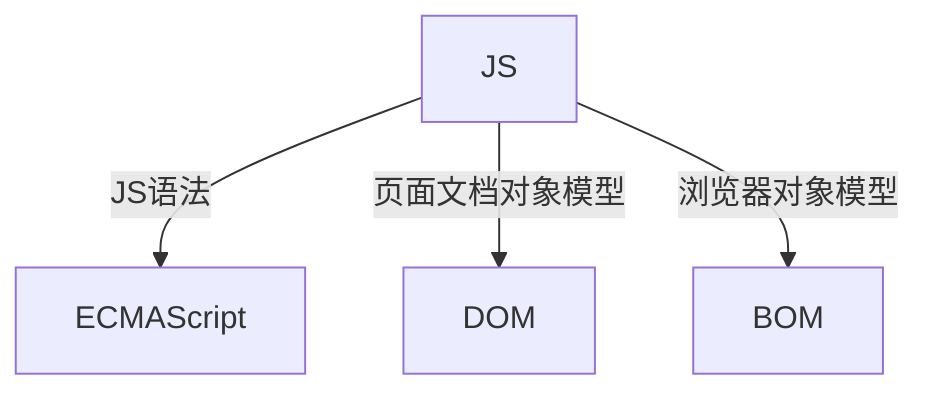
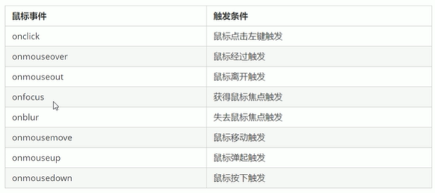
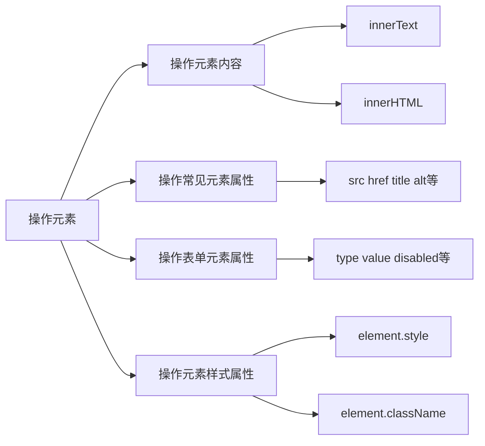

# API
应用程序编程接口，就是一个工具，以便于能轻松实现想要完成的功能
# Web API
Web API是浏览器提供的一套操作浏览器功能和页面元素的API（DOM和BOM）
# DOM
可以改变网页的内容、结构和样式
## DOM树


文档：一个页面就是一个文档  document
元素：页面中的所有标签都是元素，element
节点：网页中的所有内容都是节点（标签、属性、文本、注释等），node
**DOM把以上内容都看作是对象**

# DOM操作
## 获取元素
### getElementById()
注意：
- 因为文档页面从上往下加载，所以先有标签，然后才能getElementById
- 参数是字符串，所以需要加引号
- 返回的是一个 element 对象

console.dir 可以打印返回的元素对象，更好的查看里面的属性和方法

### getElementsByTagName()
- 参数是字符串，所以需要加引号d
- 得到的是对象的集合，可以用遍历来获取所有对象
- 得到的是动态的
例子: 获取ol里面的li
```html

<ol>
<li>123一二三四五</li>
<li>123上山打老虎</li>
<li>123老虎有几只</li>
<li>123快来数一数</li>
<li>123一二三四五</li>
</ol>
<script>
var ol = document.getElementsByTagName('ol');
//伪数组不能做父元素
var list = ol[0].getElementsByTagName('li');
console.log(list);
console.dir(list);

```
### getElementsByClassName()
类名选择器
### querySelector()
HTML5新增的
返回指定选择器的**第一个对象**
```html

<div class="box">
<ul>
<li>15212</li>
<li>1641238</li>
</ul>
</div>
<div class="box">
<ul>
<li>151232</li>
<li>1612348</li>
</ul>
</div>
<script>
//注意这里括号里面必须有“.”，因为需要指定选择的选择器
var boxs = document.querySelector('.box');
console.log(boxs);
</script>

```
### querySelectorAll()
返回指定选择器的所有对象集合
用法和querySelector()一样

### document.body
获取body元素
### document.documentElement
获取html元素

## 事件基础

JavaScript使我们有能力创建动态页面，而事件是可以被JavaScript侦测到的行为。
网页中的每个元素都可以产生某些触发JavaScript的事件。

### 事件由三部分组成：

- 事件源   事件被触发的对象 比如按钮
- 事件类型   如何触发 比如鼠标点击、鼠标经过、键盘按下、滚动滚轮
- 事件处理程序   通过函数赋值的方式完成
```html

<button id="btn">按钮</button>
<script>
var btn = document.getElementById('btn');
btn.onclick = function () {
alert('触发事件');
}
</script>

```

事件都有：



## 操作元素

JavaScript可以改变网页内容、结构和样式，我们可以利用DOM操作元素来改变元素里面的内容、属性等。

### element.innerText

- 从起始位置到终止位置的内容，但它去除Html标签，同时空格和换行也会去掉
- innerText不识别HTML标签
- 可读写的，可以获取元素里面的内容

### element.innerHTML

- 从起始位置到终止位置的全部内容，包括Html标签，同时保留空格和换行
- 能识别HTML标签
- 可读写的，可以获取元素里面的内容

### 修改表单属性

disabled 	让某个表单被禁用，不能被点击，
用法：
```javascript
btn.onclick = function () {
    btn.disabled = true;
    //或者写成下面这种
    this.disabled = true;
    //this指向的是时间函数的调用者
}
```

**案例**：仿京东显示密码，点击按钮将密码框显示为文本框，并可以查看密码明文

算法：利用一个flag变量，如果是1就切换为文本框，如果是0就切换为密码框

```html
<!DOCTYPE html>
<html lang="en">
<head>
    <meta charset="UTF-8">
    <title>Document</title>
    <style>
    * {
        margin: 0;
        padding: 0;
    }
    form {
        position: relative;
        width: 1000px;
        height: 500px;
        border: 1px solid red;
        margin: 100px auto 0;
    }
    input {
        display: block;
        width: 800px;
        height: 50px;
        line-height: 30px;
        color: #3c3c3c;
        margin: 50px auto 50px;
        padding-left: 20px;
        box-sizing: border-box;
        border: 1px solid red;
    }
    label img {
        top: 164px;
        right: 120px;
        position: absolute;
        width: 24px;
    }
    </style>
</head>
<body>
    <form action="#">
        <input type="text" id="userName" placeholder="请输入你的用户名">
        <label for="">
            
        </label>
        <input type="password" id="password" placeholder="请输入你的密码">
    </form>
    <script>
    var eye = document.querySelector('img');
    var password = document.getElementById('password');
    var flag = 0;
    eye.onclick = function () {
        if (flag === 0) {
            password.type = 'text';
            eye.src = 'images/睁眼.png';
            flag = 1;
        } else {
            password.type = 'password';
            eye.src = 'images/闭眼.png';
            flag = 0;
        }
 
    }
    </script>
</body>
</html>
```

### 修改样式属性

#### element.style
行内样式操作，修改元素样式，如果样式比较少或者功能简单的情况下使用
注意：
- 里面的属性是驼峰命名法
- JS修改的是行内样式，权重比CSS的高
#### element.className
类名样式操作，适合样式比较多的情况下使用
修改了元素的类名
**注意：**这个方法直接修改了类名，也就是说会覆盖原来的类名，原来的就不生效了
如果想要保留原先的类名，这样做：

```
//假设first 是原来的类名，change是想加入的
this.className = 'first change';
```

#### 表单事件

获得焦点 onfocus
失去焦点 onblur

案例：京东搜索框，默认是“手机”两个字，当用户点击搜索框的时候，“手机”两个字消失，当输入文本之后，保持文本内容不变

分析：
- 如果获得焦点，判断里面是否是默认文字，如果是默认文字，就清空表单内容
- 如果失去焦点，判断表单是否为空，如果为空，则表单内容改为默认文字
- 获得焦点的时候，把文本框里的文字变黑
- 失去焦点的时候，文本框文字变浅

```
<input type="text" value="手机">
<script>
var input = document.querySelector('input');
input.onfocus = function () {
    if (this.value === '手机') {
    	input.value = '';
    }
    this.style.color = '#3c3c3c'; 
}
input.onblur = function () {
    if (this.value === '') {
    	input.value = '手机';
    }
    this.style.color = '#999';
}
</script>
```

案例：密码提示框，选中的时候提示密码的长度和标准，失去焦点的时候，检查密码是否合乎规范

分析：
- 如果获得焦点，提示密码的长度和标准
- 如果失去焦点，检查密码是否合乎规范，如果不符合规范，就提示
- 因为改变的样式比较多，所以用className来修改样式

```
<!DOCTYPE html>
<html lang="en">
<head>
    <meta charset="UTF-8">
    <title>Document</title>
    <style>
    div {
        width: 600px;
        margin: 100px auto;
    }
    .message {
        display: inline-block;
        font-size: 12px;
        color: #999;
        background: url(images/message.png) no-repeat left center;
        background-size: 16px;
        padding-left: 20px;
    }
    .error {
        display: inline-block;
        font-size: 12px;
        color: red;
        background: url(images/error.png) no-repeat left center;
        background-size: 16px;
        padding-left: 20px;
    }
    .right {
        display: inline-block;
        font-size: 12px;
        color: green;
        background: url(images/right.png) no-repeat left center;
        background-size: 16px;
        padding-left: 20px;
    }
    </style>
</head>
<body>
    <div class="register">
        <input type="password" class="pwd">
        <p class="message">请输入6~16位密码</p>
    </div>
    <script>
    var pwd = document.querySelector('.pwd');
    var message = document.querySelector('.message');
    pwd.onblur = function() {
        if (pwd.value.length > 16 || pwd.value.length < 6) {
            
            message.className = 'error';
            message.innerHTML = '您输入的位数不对，要求6~16位';
        } else {
            message.className = 'right';
            message.innerHTML = '对辽~';
        }
    }
    </script>
</body>
</html>
```

### 操作元素总结




