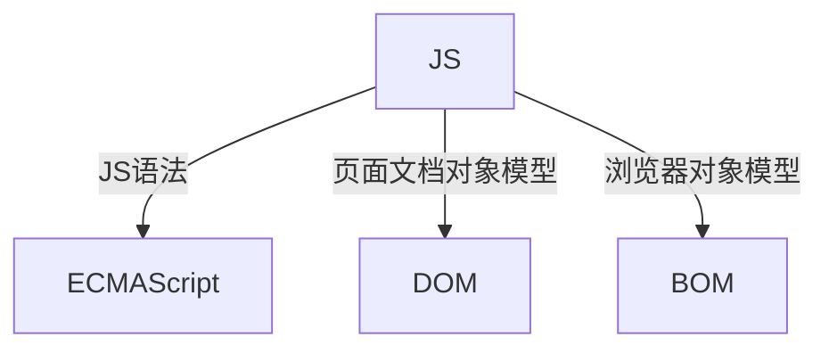

## API
应用程序编程接口，就是一个工具，以便于能轻松实现想要完成的功能
## Web API
Web API是浏览器提供的一套操作浏览器功能和页面元素的API（DOM和BOM）
## DOM
可以改变网页的内容、结构和样式
### DOM树


文档：一个页面就是一个文档  document
元素：页面中的所有标签都是元素，element
节点：网页中的所有内容都是节点（标签、属性、文本、注释等），node
**DOM把以上内容都看作是对象**

## DOM操作
### 获取元素
#### getElementById()
注意：
- 因为文档页面从上往下加载，所以先有标签，然后才能getElementById
- 参数是字符串，所以需要加引号
- 返回的是一个 element 对象

console.dir 可以打印返回的元素对象，更好的查看里面的属性和方法

#### getElementsByTagName()
- 参数是字符串，所以需要加引号d
- 得到的是对象的集合，可以用遍历来获取所有对象
- 得到的是动态的
例子: 获取ol里面的li
```

<ol>
<li>123一二三四五</li>
<li>123上山打老虎</li>
<li>123老虎有几只</li>
<li>123快来数一数</li>
<li>123一二三四五</li>
</ol>
<script>
var ol = document.getElementsByTagName('ol');
//伪数组不能做父元素
var list = ol[0].getElementsByTagName('li');
console.log(list);
console.dir(list);

```
#### getElementsByClassName()
类名选择器
#### querySelector()
HTML5新增的
返回指定选择器的**第一个对象**
```

<div class="box">
<ul>
<li>15212</li>
<li>1641238</li>
</ul>
</div>
<div class="box">
<ul>
<li>151232</li>
<li>1612348</li>
</ul>
</div>
<script>
//注意这里括号里面必须有“.”，因为需要指定选择的选择器
var boxs = document.querySelector('.box');
console.log(boxs);
</script>

```
#### querySelectorAll()
返回指定选择器的所有对象集合
用法和querySelector()一样
#### document.body
获取body元素
#### document.documentElement
获取html元素

### 事件基础

