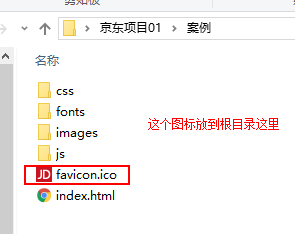
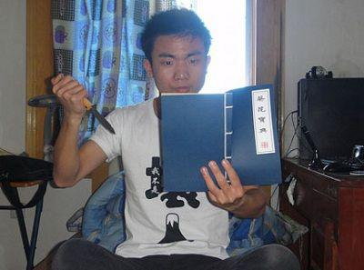
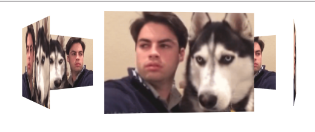

---
学习目标:

  - 掌握京东项目流程体系
  - 掌握网站三大标签优化
  - 掌握京东头部和尾部制作
  - 掌握京导航栏制作
  - 掌握京东焦点图制作
  - 了解网站三大标签优化
  - 理解BFC
  - 了解渐进增强和优雅降级

  typora-copy-images-to: media
---
----------------------------------------------------------------------------------------------------------------------------------------------------------------------------------------------------------------

# 京东项目(一)

## 京东项目介绍

项目名称：京东网
项目描述：京东首页公共部分的头部和尾部制作，京东首页中间部分。


##  项目背景

现阶段电商类网站很流行，很多同学毕业之后会进入电商类企业工作，同时电商类网站需要的技术也是较为复杂的，这里用京东电商网站复习、总结、提高前面所学布局技术。其实，最主要的原因还是，为啥写京东？  因为刘强东，赚了我们的钱，抢了我们的女神， 我们也要学刘强东，赚别人的钱，抢别人..额，自己的女神。。。

## 设计目标

- 保证浏览器 ie7及以上, 火狐, 360, safari，chrome等。谁让我再测ie6，就跟谁急。。

- 熟悉CSS+DIV布局，页面的搭建工作

- 了解常用电商类网站的布局模式

- 为后期京东移动端做铺垫

## 几点思考


(1). 开发工具  sublime  、fireworks（ps）、各种浏览器(ie6.7 要测看心情)

(2). CSS Rest 类库,为跨浏览器兼容做准备(也可以直接运用jd网站的初始化)


```
normalize.css   只是一个很小的CSS文件，但它在默认的HTML元素样式上提供了跨浏览器的高度一致性。相比于传统的CSS reset，Normalize.css是一种现代的、为HTML5准备的优质替代方案。Normalize.css现在已经被用于Twitter Bootstrap、HTML5 Boilerplate、GOV.UK、Rdio、CSS Tricks 以及许许多多其他框架、工具和网站上。 你值得拥有。。 

- 保护有用的浏览器默认样式而不是完全去掉它们

- 一般化的样式：为大部分HTML元素提供

- 修复浏览器自身的bug并保证各浏览器的一致性

- 优化CSS可用性：用一些小技巧

- 解释代码：用注释和详细的文档来
```

(3). 技术栈

~~~
HTML5 结构 + CSS3  布局 (因为我们就会这些。。。嘻嘻)
~~~


(4). 低版本浏览器 单独制作一个跳转页面 (都是孩子，也舍不得打，舍不得扔)

https://h5.m.jd.com/dev/3dm8aE4LDBNMkDfcCaRxLnVQ7rqo/index.html


## 目录说明


要实现结构和样式相分离的设计思想。 根目录下有这4个文件（目录）。

| 名称     | 说明                 |
| ------ | ------------------ |
| css    | 用于存放CSS文件          |
| images | 用于存放图片             |
| index  | 京东首页 HTML          |
| js     | 用于后期存放javascript文件 |


## 运用知识点

###  引入ico图标

  


    代码：  <link rel="shortcut icon" href="favicon.ico"  type="image/x-icon"/>     
注意： 

1. 她(它)不是iconfont字体哦。

2. 位置是放到 head 标签中间。

3. 后面的type="image/x-icon"  属性可以省略。（我相信你也愿意省略。）

4. 为了兼容性，请将favicon.ico 这个图标放到根目录下。（我们就不要任性了，听话放位置，省很多麻烦。。你好，我也好）

   


### 转换ico图标

我们可以自己做的图片，转换为 ico图标，以便放到我们站点里面。 http://www.bitbug.net/

###  网站优化三大标签

SEO是由英文Search Engine Optimization缩写而来， 中文意译为“搜索引擎优化”！SEO是指通过对网站进行站内优化、网站结构调整、网站内容建设、网站代码优化等)和站外优化，从而提高网站的关键词排名以及公司产品的曝光度。 简单的说就是，把产品做好，搜索引擎就会介绍客户来。  

 我们现在阶段主要进行站内优化。网站优化，我们应该要懂。。。


####  网页title 标题
title具有不可替代性，是我们的内页第一个重要标签，是搜索引擎了解网页的入口，和对网页主题归属的最佳判断点。


建议：

首页标题：网站名（产品名）- 网站的介绍    

例如：

京东(JD.COM)-综合网购首选-正品低价、品质保障、配送及时、轻松购物！


小米商城 - 小米5s、红米Note 4、小米MIX、小米笔记本官方网站

####  Description  网站说明

对于关键词的作用明显降低，但由于很多搜索引擎，仍然大量采用网页的MATA标签中描述部分作为搜索结果的“内容摘要”。 就是简要说明我们网站的主要做什么的。
我们提倡，Description作为网站的总体业务和主题概括，多采用“我们是…”“我们提供…”“×××网作为…”“电话：010…”之类语句。

京东网：

    <meta name="description" content="京东JD.COM-专业的综合网上购物商城,销售家电、数码通讯、电脑、家居百货、服装服饰、母婴、图书、食品等数万个品牌优质商品.便捷、诚信的服务，为您提供愉悦的网上购物体验!" />
注意点：

1.  描述中出现关键词，与正文内容相关，这部分内容是给人看的，所以要写的很详细，让人感兴趣， 吸引用户点击。
2.  同样遵循简短原则，字符数含空格在内不要超过 120  个汉字。
3.  补充在 title  和 keywords  中未能充分表述的说明.
4.  用英文逗号 关键词1,关键词2

~~~
<meta name="description" content="小米商城直营小米公司旗下所有产品，囊括小米手机系列小米MIX、小米Note 2，红米手机系列红米Note 4、红米4，智能硬件，配件及小米生活周边，同时提供小米客户服务及售后支持。" />
~~~
####  Keywords 关键字

Keywords是页面关键词，是搜索引擎关注点之一。Keywords应该限制在6～8个关键词左右，电商类网站可以多一些。

京东网：


    <meta name="Keywords" content="网上购物,网上商城,手机,笔记本,电脑,MP3,CD,VCD,DV,相机,数码,配件,手表,存储卡,京东" />
小米网：


    <meta name="keywords" content="小米,小米6,红米Note4,小米MIX,小米商城" />

## 顶部（快捷菜单）所用知识点

| 知识点                 | 说明                                       |
| ------------------- | ---------------------------------------- |
| 通栏的盒子               | 不用给宽度  默认为 100% &nbsp;但是加了浮动和定位的盒子需要 添加 100% |
| 盒子居中对齐              | margin: auto;  注意必须有宽度的块级元素，文字水平居中对齐是 text-align:center; |
| 行高会继承               | 文字性质的，比如 颜色、文字大小、字体、行高等会继承父级元素           |
| 浮动元素、固定定位，绝对定位会模式转换 | 具有行内块特性，比如一行放多个，有高度和宽度，如果没有指定宽度，则会根据内容多少撑开。 |

##  logo 和搜索 header 区域所用知识点

### 网页布局稳定性 


### 宽度剩余法：


| 知识点    | 说明                                       |
| ------ | ---------------------------------------- |
| 浮动元素特性 | 1. 浮动可以让多个元素同一行显示 2. 浮动的元素是顶部对齐          |
| logo优化 | text-indent: -20000px; 隐藏文字， 背景图片        |
| 清除浮动   | 清除浮动的目的就是为了解决父亲高度为0的问题                   |
| 鼠标样式   | cursor: pointer;           小手      cursor: move;            四角箭头     cursor: text;  插入光标     cursor: default;  小白 |
| 不允许换行  | white-space: nowrap;                     |

## nav导航栏所用知识点

| 名称      | 说明                                       |
| ------- | ---------------------------------------- |
| 边框底侧    | border-bottom: 2px solid #ccc;           |
| 定位重点    | 绝对定位不占位置  相对定位占有位置                       |
| 标签语义化dl | dl也是块级元素 dt 是 定义标题  dd 是定义描述，dd是围绕这dt来描述的，也就是说，dd算是dt 的解释说明详细分解。 |
| 标题标签h   | 尽量少用h1，可以多用h2和h3等标签                      |

## 页面底部所用知识点

| 名称          | 说明                                       |
| ----------- | ---------------------------------------- |
| 绝对定位的盒子居中对齐 | 盒子 left 50%  然后通过 margin 负值自己的宽度一半（固定定位也是如此） |


###  固定定位的盒子靠近版心右侧对齐

跟绝对定位的盒子居中对齐原理差不多。

left 50%   然后 margin-left  版心宽度一半。


学习目标:

- 掌握京东中间部分制作
- 理解BFC使用
- 了解优雅降级和渐进增强
- 了解CSS压缩和验证工具

  typora-copy-images-to: media

------

# 京东项目(二)

## nav导航栏所用知识点

| 名称      | 说明                                       |
| ------- | ---------------------------------------- |
| 边框底侧    | border-bottom: 2px solid #ccc;           |
| 定位重点    | 绝对定位不占位置  相对定位占有位置                       |
| 标签语义化dl | dl也是块级元素 dt 是 定义标题  dd 是定义描述，dd是围绕这dt来描述的，也就是说，dd算是dt 的解释说明详细分解。 |
| 标题标签h   | 尽量少用h1，可以多用h2和h3等标签                      |

### 固定定位的盒子靠近版心右侧对齐

跟绝对定位的盒子居中对齐原理差不多。

left 50%   然后 margin-left  版心宽度一半。


## 焦点图部分所用知识点

| 名称   | 说明                               |
| ---- | -------------------------------- |
| 圆角矩形 | border-radius: 左上角 右上角 右下角  左下角。 |

负值自己的宽度一半（固定定位也是如此）

## 背景半透明

1.强烈推荐：  background: rgba(r,g,b,alpha);

​     r,g,b 是红绿蓝的颜色，  alpha 是透明度的意思，取值范围是 0~1 之间。

2.了解ie低版本浏览器 半透明

filter:Alpha(opacity=50) ；   // opacity值为0 到 100

但是 此属性是盒子半透明，不是背景半透明哦，因为里面的内容也一起半透明了

因此，低版本的 ie6.7浏览器，我们不需要透明了，直接采用优雅降级的做法。

background: gary;

background: rgba(0,0,0,.2);

写上两句 背景， 低版本ie只执行gray， 其他浏览器执行 半透明下面这一句。

## BFC(块级格式化上下文)

BFC(Block formatting context)

直译为"块级格式化上下文"。

BFC是一个独立的渲染区域，只有Block-level box参与，它规定了内部的Block-level box如何布局，并且与这个区域外部毫不相干。


### 元素的显示模式

我们前面讲过 元素的显示模式 display。 

分为 块级元素   行内元素  行内块元素 ，其实，它还有很多其他显示模式。


### 那些元素会具有BFC的条件

不是所有的元素模式都能产生BFC，w3c 规范： 

display 属性为 block, list-item, table 的元素，会产生BFC.

大家有么有发现这个三个都是用来布局最为合理的元素，因为他们就是用来可视化布局。

注意其他的，display属性，比如 line 等等，他们创建的是 IFC ，我们暂且不研究。

这个BFC 有着具体的布局特性： 


有宽度和高度 ， 有 外边距margin  有内边距padding 有边框 border。

就好比，你有了练习武术的体格了。 有潜力，有资质。


### 什么情况下可以让元素产生BFC

以上盒子具有BFC条件了，就是说有资质了，但是怎样触发才会产生BFC，从而创造这个封闭的环境呢？ 

在好比，你光有资质还不行，你需要一定额外效果才能出发的武学潜力，要么你掉到悬崖下面，捡到了一本九阴真经，要么你学习葵花宝典，欲练此功必先....


同样，要给这些元素添加如下属性就可以触发BFC。

-float属性不为none

-position为absolute或fixed

-display为inline-block, table-cell, table-caption, flex, inline-flex

-overflow不为visible。

### BFC元素所具有的特性

BFC布局规则特性：

1.在BFC中，盒子从顶端开始垂直地一个接一个地排列.

2.盒子垂直方向的距离由margin决定。属于同一个BFC的两个相邻盒子的margin会发生重叠

3.在BFC中，每一个盒子的左外边缘（margin-left）会触碰到容器的左边缘(border-left)（对于从右到左的格式来说，则触碰到右边缘）。

1. BFC的区域不会与浮动盒子产生交集，而是紧贴浮动边缘。
2. 计算BFC的高度时，自然也会检测浮动或者定位的盒子高度。

它是一个独立的渲染区域，只有Block-level box参与， 它规定了内部的Block-level Box如何布局，并且与这个区域外部毫不相干。

白话文： 孩子在家里愿意怎么折腾都行，但是出了家门口，你就的乖乖的，不能影响外面的任何人。


### BFC的主要用途

BFC能用来做什么？

(1) 清除元素内部浮动

只要把父元素设为BFC就可以清理子元素的浮动了，最常见的用法就是在父元素上设置overflow: hidden样式，对于IE6加上zoom:1就可以了。

主要用到 

```
计算BFC的高度时，自然也会检测浮动或者定位的盒子高度。
```


(2) 解决外边距合并问题

外边距合并的问题。

主要用到 

```
盒子垂直方向的距离由margin决定。属于同一个BFC的两个相邻盒子的margin会发生重叠
```

属于同一个BFC的两个相邻盒子的margin会发生重叠，那么我们创建不属于同一个BFC，就不会发生margin重叠了。


(3) 制作右侧自适应的盒子问题

主要用到 

```
普通流体元素BFC后，为了和浮动元素不产生任何交集，顺着浮动边缘形成自己的封闭上下文
```


### BFC 总结

BFC就是页面上的一个隔离的独立容器，容器里面的子元素不会影响到外面的元素。反之也如此。包括浮动，和外边距合并等等，因此，有了这个特性，我们布局的时候就不会出现意外情况了。

## 优雅降级和渐进增强

什么是渐进增强（progressive enhancement）、优雅降级（graceful degradation）呢？

渐进增强 progressive enhancement：

针对低版本浏览器进行构建页面，保证最基本的功能，然后再针对高级浏览器进行效果、交互等改进和追加功能达到更好的用户体验。

 类似 爬山，由低出往高处爬

  

  <b>优雅降级 graceful degradation：</b>

一开始就构建完整的功能，然后再针对低版本浏览器进行兼容。

类似蹦极，由高处往低处下落


　　区别：渐进增强是向上兼容，优雅降级是向下兼容。

个人建议： 现在互联网发展很快， 连微软公司都抛弃了ie浏览器，转而支持 edge这样的高版本浏览器，我们很多情况下没有必要再时刻想着低版本浏览器了，而是一开始就构建完整的效果，根据实际情况，修补低版本浏览器问题。

## 浏览器前缀

| 浏览器前缀    | 浏览器                                    |
| -------- | -------------------------------------- |
| -webkit- | Google Chrome, Safari, Android Browser |
| -moz-    | Firefox                                |
| -o-      | Opera                                  |
| -ms-     | Internet Explorer, Edge                |
| -khtml-  | Konqueror                              |


后面我们会有 常用的解决H5和C3 的兼容解决文件， 我们这里暂且不涉及。

## 背景渐变

在线性渐变过程中，颜色沿着一条直线过渡：从左侧到右侧、从右侧到左侧、从顶部到底部、从底部到顶部或着沿任何任意轴。如果你曾使用过制作图件，比如说Photoshop，你对线性渐变并不会陌生。

兼容性问题很严重，我们这里之讲解线性渐变

语法格式： 

~~~css
background:-webkit-linear-gradient(渐变的起始位置， 起始颜色， 结束颜色)；
~~~

~~~css
background:-webkit-linear-gradient(渐变的起始位置， 颜色 位置， 颜色位置....)；
~~~


## CSS W3C 统一验证工具

CssStats 是一个在线的 CSS 代码分析工具

```
网址是：  http://www.cssstats.com/
```


如果你想要更全面的，这个神奇，你值得拥有：

W3C 统一验证工具：    http://validator.w3.org/unicorn/  ☆☆☆☆☆

因为它可以检测本地文件哦！！

## CSS 压缩

通过上面的检测没有错误，为了提高加载速度和节约空间（相对来说，css量很少的情况下，几乎没啥区别），可以通过css压缩工具把css进行压缩。

 w3c css压缩   http://tool.chinaz.com/Tools/CssFormat.aspx   网速比较慢

 还可以去站长之家进行快速压缩。

 http://tool.chinaz.com/Tools/CssFormat.aspx  

## 旋转轮播图



这个效果我们需要用到  透视  过渡还有 子元素  preserve-3d

### transform-style

`transform-style`属性是3D空间一个重要属性，指定嵌套元素如何在3D空间中呈现。他主要有两个属性值：`flat`和`preserve-3d`。

其中`flat`值为默认值，表示所有子元素在2D平面呈现。`preserve-3d`表示所有子元素在3D空间中呈现。

~~~css
 body {
        	perspective: 1000px;
        }
		section {
			width: 300px;
			height: 200px;
			margin: 100px auto;
			background: url(images/img-1.jpg) no-repeat;
			background-size: cover;
			position: relative;
			transform-style: preserve-3d;  /* 让父盒子里面的子盒子以3d效果显示 */
			transition:  5s linear;  /* 匀速  all 是可以省略的， 省略默认的all*/
		}
		section:hover {
			transform: rotateY(360deg);
		}
		section div {
			width: 100%;
			height: 100%;
			background: url(images/dog.gif) no-repeat;
			background-size: cover;
			position: absolute;
			top: 0;
			left: 0;
		}
		section div:nth-child(1) {
			transform: rotateY(0deg)  translateZ(400px);
		}
		section div:nth-child(2) {
			transform: rotateY(60deg)  translateZ(400px);
		}
		section div:nth-child(3) {
			transform: rotateY(120deg)  translateZ(400px);
		}
		section div:nth-child(4) {
			transform: rotateY(180deg)  translateZ(400px);
		}
		section div:nth-child(5) {
			transform: rotateY(240deg)  translateZ(400px);
		}
		section div:nth-child(6) {
			transform: rotateY(300deg)  translateZ(400px);
		}
~~~

